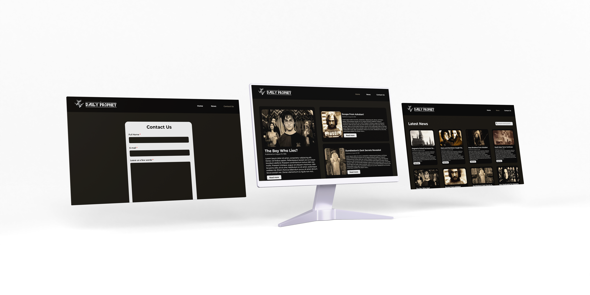

 

# Daily Prophet

O Daily Prophet é um blog de notícias fictício baseado no jornal que há na saga de Harry Potter, este projeto será desenvolvido com as seguintes tecnologias:
* HTML
* CSS

Nesta atividade, foi desenvolvido: 
* Páginas do HEADER: Home, News, Contact US.
* Páginas isoladas para cada notícia em Home e News (para visualizar, basta clicar em 'read more').

Página finalizada: [Clique aqui](https://portelagu.github.io/DailyProphet/).

#
>Responsividade está em construção...